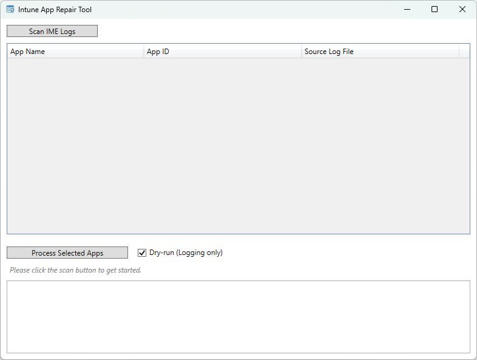

# IntuneAppRepairTool

**IntuneAppRepairTool** is a utility to help IT admins **manually clean up Intune Win32 app deployments** using either a graphical interface or command-line.  
It helps by:
- Discovering deployed app names and App IDs from IME logs
- Cleaning related registry keys for selected App IDs
- Restarting the Intune Management Extension (IME)
- Relaunching the Company Portal

---

### 💡 Example Use Case

Imagine this scenario:

- A required app is deployed via Intune and appears as *Installed* in Company Portal.
- The user (or IT) **manually uninstalls** the app via "Add or Remove Programs".
- **Company Portal still shows it as Installed**, even though it's gone.
  - This is because IME may take hours (sometimes up to 24+) to re-evaluate and update app status.
  - Until then, **Company Portal won’t offer a reinstall option**, leaving the user stuck.

**IntuneAppRepairTool** solves this by:
- Letting you manually clean up leftover registry traces for the app
- Forcing IME to restart and re-check app status immediately
- Making the app available again in Company Portal within seconds

---

### ⚠️ Disclaimer

This tool was originally thrown together quickly to address the possibility of such scenarios. As such, it’s **functional but far from perfect**, and likely **lacks polish, test coverage, and broader edge-case handling**.

You're welcome to use, fork, or improve it as needed. Contributions, suggestions, or refactors are always appreciated.

Use at your own risk, and always test in a safe environment before using in production.

---

## 🔀 Version Overview

| Version | Features                  | Runtime                | Branch           |
|---------|---------------------------|------------------------|------------------|
| v1.x    | GUI-only                  | .NET Framework 4.7.2   | `main`           |
| v2.x+   | GUI + Command-line (CLI)  | .NET 8 (self-contained) | `gui-plus-cli`   |

---

## 🖥️ GUI Usage (v1.x and v2.x)

1. **Run as Administrator**
2. Click `Scan IME Logs` to view all discovered Intune Win32 apps
3. Select one or more apps from the list
4. Choose dry-run (preview only) or live mode (actual cleanup)
5. Click `Process Selected Apps`

✅ The tool will:
- Terminate the Company Portal (if running)
- Remove all matching registry entries for each App ID
- Restart the Intune Management Extension (IME)
- Relaunch the Company Portal



---

## 🧰 CLI Usage (v2.0+ only)

Available in **v2.0+** for automation and remote execution.

### ❗ Requires Administrator rights

### Supported switches:

| Argument               | Description                                                       |
|------------------------|-------------------------------------------------------------------|
| `--list`               | Lists all app names and App IDs found in IME logs                |
| `--appId=<GUID>`       | Targets a specific App ID for cleanup                            |
| `--live` (optional)    | If specified, commits changes; otherwise performs a dry-run only |

---

### CLI Examples

```powershell
# List apps with their App IDs from IME logs
IntuneAppRepairTool.exe --list

# Preview cleanup actions for a specific App ID (no changes made)
IntuneAppRepairTool.exe --appId=YOUR-APP-ID

# Perform actual cleanup for a specific App ID
IntuneAppRepairTool.exe --appId=YOUR-APP-ID --live
```

---

## 🧪 What Does the Tool Do?

- **Scans** `C:\ProgramData\Microsoft\IntuneManagementExtension\Logs\` to list apps and App IDs
- **Finds & deletes** all relevant registry keys:
  - `HKLM\SOFTWARE\Microsoft\IntuneManagementExtension\Win32Apps`
  - `...StatusServiceReports`, `...Reporting\AppAuthority`, and GRS keys
- **Restarts** the `IntuneManagementExtension` service
- **Reopens** Company Portal using `shell:AppsFolder\...`

---

## 📦 Download & Releases

Get the latest prebuilt `.exe` files from the [**Releases tab**](https://github.com/tjgruber/IntuneAppRepairTool/releases).

- `v1.x` — GUI only
- `v2.x+` — Self-contained single `.exe` (GUI + CLI support)

---

## 💻 Building the Project

To build the latest version (v2.x):

```bash
dotnet publish -c Release -r win-x64 --self-contained true /p:PublishSingleFile=true
```

Outputs a standalone `.exe` in:

```bash
bin\Release\net8.0-windows\win-x64\publish\
```
